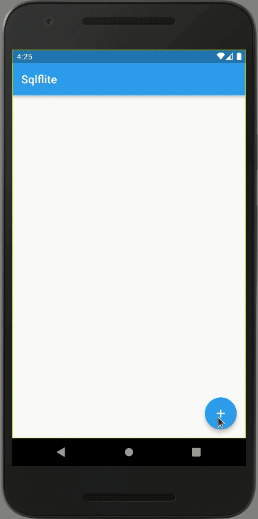

# sqlite_crud

A small Flutter app that uses SQLite to persist data.
SQLite is a fast relational database that can be used to store data offline for mobile applications.
`CRUD` means **create**, **read**, **update**, and **delete**, the four essential operations of persistent storage.

## Aplication Preview

